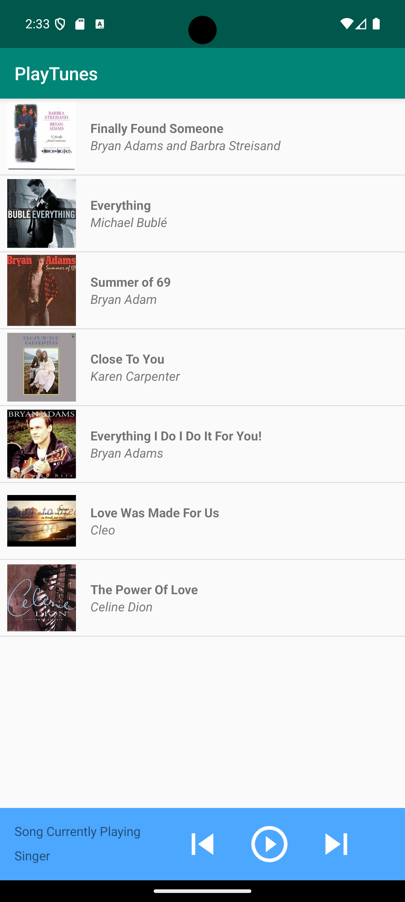
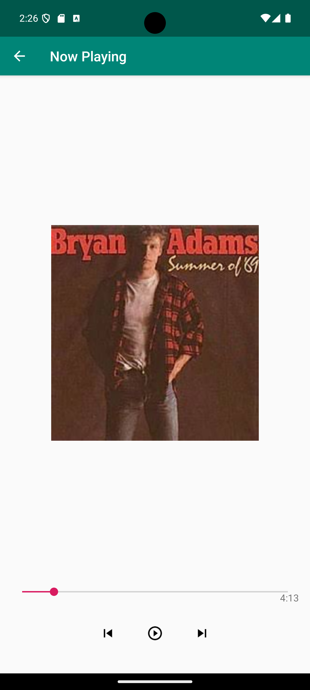

# PlayTunes 🎵


A simple and elegant Android music player application built with Java, featuring a clean user interface and essential music playback controls. This is a UI prototype showcasing modern Android development practices with a focus on user experience design.

## 📋 Project Type
**UI Prototype / Educational Project**
- Mobile Application (Android)
- Music Player Interface
- Learning/Portfolio Project
- Open Source

## 🏷️ Keywords
`android` `java` `music-player` `ui-prototype` `mobile-app` `material-design` `listview` `custom-adapter` `android-studio` `gradle` `androidx` `music-app` `audio-player-ui` `android-development` `mobile-ui` `java-android` `playlist` `song-library` `media-player-ui` `android-project`

## 📱 Features

- **Song Library**: Browse through a curated list of songs with high-quality album artwork
- **Clean Material UI**: Intuitive and user-friendly interface following Material Design principles
- **Interactive Controls**: Visual feedback for play/pause button states
- **Now Playing Screen**: Dedicated full-screen view showing current song details with large album artwork
- **Song Details**: Display song name, artist, and formatted duration (MM:SS)
- **Responsive Design**: Optimized layouts for different screen densities (hdpi, mdpi, xhdpi, xxhdpi, xxxhdpi)
- **Bottom Control Bar**: Quick access controls on the main screen

## ✅ What's Working

- ✅ **Song List Display**: Browse and view all songs with artwork
- ✅ **Song Selection**: Tap any song to view details on the now playing screen
- ✅ **Now Playing Screen**: Full-screen view with song information
- ✅ **Play/Pause Toggle**: Visual button state changes (UI only, no audio)
- ✅ **Duration Display**: Formatted song duration in MM:SS format
- ✅ **Multi-Density Support**: Optimized for various screen sizes
- ✅ **Material Design UI**: Modern, clean interface with Material Design icons

- **Language**: Java 8
- **Platform**: Android (Min SDK 17, Target SDK 34)
- **IDE**: Android Studio
- **UI Framework**: AndroidX AppCompat
- **UI Components**: 
  - ListView with custom ArrayAdapter
  - ImageView for album artwork
  - TextView for song information
  - ImageButton for interactive controls
  - RelativeLayout and ConstraintLayout
- **Architecture**: Activity-based navigation with Intent data passing
- **Dependencies**:
  - AndroidX AppCompat 1.6.1
  - ConstraintLayout 2.1.4
  - JUnit 4.13.2 (testing)
  - Espresso 3.5.1 (UI testing)

## 📋 Requirements

- **Minimum SDK**: Android 4.2 (API 17)
- **Target SDK**: Android 14 (API 34)
- **Compile SDK**: 34
- **Java**: Version 8 compatibility
- **Build Tool**: Gradle
- **IDE**: Android Studio (recommended)
- **Device**: Android device or emulator running API 17+

## 🚀 Getting Started

### Prerequisites
- Android Studio Arctic Fox or later
- Android SDK with API 17+ support
- Java 8 or higher
- Git (for cloning)

### Installation Steps

1. **Clone the repository**:
   ```bash
   git clone https://github.com/sandesha21/PlayTunes-Music-Player
   cd MyMusicPlayer
   ```

2. **Open in Android Studio**:
   - Launch Android Studio
   - Select "Open an existing Android Studio project"
   - Navigate to the cloned directory and select it

3. **Sync Project**:
   - Android Studio will automatically sync Gradle files
   - Wait for the sync to complete

4. **Build and Run**:
   - Connect an Android device or start an emulator
   - Click the "Run" button or press `Shift + F10`
   - Select your target device and click "OK"


### Building APK
```bash
./gradlew assembleDebug
```
The APK will be generated in `app/build/outputs/apk/debug/`

## 📂 Project Structure

```
PlayTunes-Music-Player/
├── app/                                   # Main application module
│   ├── src/main/java/com/sandesh/android/playtunes/
│   │   ├── MainActivity.java              # Main activity with song list
│   │   ├── Song.java                      # Song model class
│   │   ├── SongAdapter.java               # Custom ListView adapter
│   │   └── SongCurrentlyPlaying.java      # Now playing screen
│   ├── src/main/res/
│   │   ├── drawable/                      # Images and icons
│   │   ├── layout/                        # XML layouts
│   │   ├── mipmap-*/                      # App icons
│   │   └── values/                        # Strings, colors, styles
│   ├── src/androidTest/                   # Instrumented tests
│   ├── src/test/                          # Unit tests
│   └── build.gradle                       # App build config
├── screenshots/                           # App screenshots
├── gradle/                                # Gradle wrapper
├── .gitignore                             # Git ignore rules
├── README.md                              # Project documentation
├── build.gradle                           # Project build config
├── settings.gradle                        # Gradle settings
└── LICENSE                                # MIT License
```

## 🔧 Key Components

### MainActivity
- Displays the main song list using ListView with custom adapter
- Handles song selection and navigation to now playing screen
- Contains bottom playback control bar with play/pause functionality
- Implements click listeners for interactive UI elements
- Passes song data via Intent extras

### Song Model
- Immutable data class representing individual songs
- Properties include:
  - Song name (String)
  - Artist name (String)
  - Duration in seconds (int)
  - Album artwork resource ID (int)
- Includes utility methods like `hasImage()` and `toString()`

### SongAdapter
- Custom ArrayAdapter extending Android's ArrayAdapter<Song>
- Handles efficient view recycling using ViewHolder pattern
- Binds song data to custom list item layout
- Displays song artwork, title, and artist information
- Provides fallback image for songs without artwork

### SongCurrentlyPlaying
- Dedicated full-screen activity for detailed song view
- Receives song data through Intent extras
- Displays large album artwork and formatted duration
- Contains interactive playback control buttons
- Implements visual feedback for button state changes

## 🎨 UI Features

- **Material Design Icons**: Uses Google's baseline icons for consistent playback controls
- **Multi-Density Support**: Includes drawable resources for hdpi, mdpi, xhdpi, xxhdpi, xxxhdpi
- **Responsive Layouts**: ConstraintLayout and RelativeLayout for flexible UI adaptation
- **Visual Feedback**: Interactive button states with icon changes (play ↔ pause)
- **High-Quality Artwork**: Optimized album cover images for visual appeal
- **Consistent Theming**: Unified color scheme and styling across activities
- **Custom List Items**: Tailored song list item design with artwork and text hierarchy

## 🔄 Future Enhancements

### Core Functionality
- [ ] **Audio Playback**: Integrate MediaPlayer for actual music playback
- [ ] **Background Service**: Implement foreground service for background playback
- [ ] **Notification Controls**: Media-style notifications with playback controls
- [ ] **Audio Focus Management**: Handle audio interruptions and focus changes

### User Experience
- [ ] **File System Integration**: Load music files from device storage
- [ ] **Playlist Management**: Create, edit, and manage custom playlists
- [ ] **Search Functionality**: Search songs by title, artist, or album
- [ ] **Favorites System**: Mark and organize favorite songs
- [ ] **Shuffle & Repeat**: Implement shuffle and repeat playback modes

### Advanced Features
- [ ] **Equalizer**: Built-in audio equalizer with presets
- [ ] **Sleep Timer**: Auto-stop playback after specified time
- [ ] **Lyrics Display**: Show synchronized lyrics if available
- [ ] **Album/Artist Views**: Browse music by albums and artists
- [ ] **Recently Played**: Track and display recently played songs
- [ ] **Dark Theme**: Implement dark mode support

## 🤝 Contributing

1. Fork the repository
2. Create a feature branch (`git checkout -b feature/AmazingFeature`)
3. Commit your changes (`git commit -m 'Add some AmazingFeature'`)
4. Push to the branch (`git push origin feature/AmazingFeature`)
5. Open a Pull Request

## 📄 License

This project is licensed under the MIT License - see the [LICENSE](LICENSE) file for details.

## 👨‍💻 Author  
**Sandesh S. Badwaik**

[](https://www.linkedin.com/in/sbadwaik/)
[](https://github.com/sandesha21)

- Package: `com.sandesh.android.playtunes`

## 🙏 Acknowledgments

- Album artwork from various artists
- Material Design icons from Google
- Android development community for best practices

---

## 📱 Screenshots

### Main Screen - Song List
<div align="center">
  
</div>

The main screen displays a list of available songs with album artwork, song titles, and artist names. Users can tap on any song to navigate to the now playing screen.

### Now Playing Screen
<div align="center">
  
</div>

The now playing screen shows a full-screen view with large album artwork, song details, and interactive playback controls (play/pause, previous, next).


## 🧪 Testing

The project includes both unit tests and instrumented tests:

```bash
# Run unit tests
./gradlew test

# Run instrumented tests (requires connected device/emulator)
./gradlew connectedAndroidTest
```

## 🐛 Known Issues

- Audio playback is not implemented (UI prototype only)
- Next/Previous buttons are non-functional (placeholder implementation)
- No persistent storage for user preferences

## 📊 Performance Considerations

- Efficient ListView with view recycling
- Optimized image resources for different screen densities
- Minimal memory footprint with static song data
- Fast app startup with lightweight architecture

---

**Note**: This is a UI prototype project demonstrating Android development best practices. Audio playback functionality is not implemented and would require additional MediaPlayer integration, audio file management, and proper service architecture for background playback.